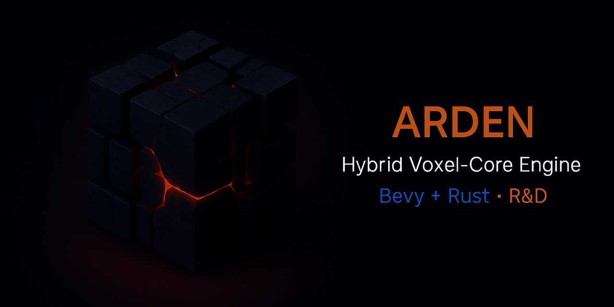

---

  

  
  
  

# **Arden Engine**
### *Hybrid Voxel-Core Engine — Rust + Bevy — R&D Architecture*

---

## 🚀 **Overview EN**

**Arden Engine** is a next-generation hybrid game engine built on **Rust + Bevy**,  
designed as an open **research & development architecture (R&D Architecture)**  
for studying procedural worlds, adaptive physics, and voxel simulations.

At its core lies the concept of a **living kernel**,  
where topology, logic, and world structure evolve organically  
without breaking internal symmetry.  
Arden is not just a game engine — it is an engineering environment  
for testing ideas, exploring material behavior, optimization, and data routing.

Arden combines engineering precision with the flexibility of a research platform,  
where every module functions as part of a unified architectural system.

The project’s goal is to create a foundation resilient to technological change and time,  
while remaining open to developers, students, and enthusiasts  
interested in exploring the mechanics of hybrid worlds and dynamic geometry.

🌍 **Language:**

🇬🇧 [**Extended description and project structure**](./root/README_EN.md)

> *Note:* the original documentation is written in Russian.  
> English versions are maintained and updated progressively for broader accessibility.

---

## 🚀 **Overview RU**

**Арден** — гибридный игровой движок нового поколения на **Rust + Bevy**,  
созданный как открытая исследовательская архитектура (**R&D Architecture**)  
для изучения процедурных миров, адаптивной физики и воксельных симуляций.

В основе Arden лежит идея **живого ядра**, где топология, логика и структура мира  
могут развиваться эволюционно — без нарушения внутренней симметрии.  
Это не просто движок для игр, а инженерная среда для тестирования идей,  
в которой исследуются поведение материи, оптимизация и маршрутизация данных.

Арден сочетает инженерную строгость с гибкостью исследовательской платформы,  
где каждый модуль является частью единой архитектурной системы.

Цель проекта — создать основу, устойчивую к изменениям технологий и времени,  
и при этом открытую для внешних разработчиков, студентов и энтузиастов,  
желающих изучать механику гибридных миров и динамическую геометрию.

🌍 **Язык:**

🇷🇺 [**Расширенное описание и структура проекта**](./root/README_RU.md)

> *Примечание:* основной язык документации — русский.  
> Английские версии поддерживаются и обновляются постепенно.

---

## 🤝 **Contributors & Collaborators**

### 🇬🇧

People who help shape, refine, and support the project —  
through code, design, research, discussion, or experimentation.

| Name / Handle | Role / Area | Links |
|---------------|-------------|-------|
| *(your name can be here)* | | |

---

### 🇷🇺

Люди, которые помогают формировать, уточнять и поддерживать проект —  
через код, дизайн, исследования, обсуждения или эксперименты.

| Имя / Ник | Роль / Область | Ссылки |
|------------|----------------|--------|
| *(ваше имя может быть здесь)* | | |

---

