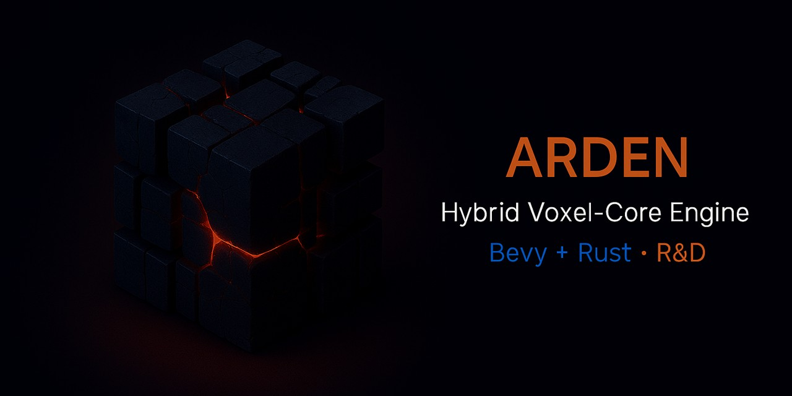

---

  

  
  
  

# **Arden Engine**
### *Hybrid Voxel-Core Engine — Rust + Bevy — R&D Architecture*

---

## 🌍 Overview (EN)

**Arden Engine** is an experimental hybrid voxel–vector engine designed for  
**R&D, simulation, procedural generation, dynamic worlds, and destruction systems.**

It combines:

- voxel topology (Region → Chunk → Octochunk → Voxel)  
- vector/mesh structures  
- strict addressing and rotation (Topology / Route / Rotation)  
- dynamic containers (DYN)  
- EQ-core with HAOS adaptive optimization  
- a modular BUS → GPU pipeline  

The project is open to ideas, discussions, experimentation, and exploration.

---

## 🌐 Обзор (RU)

Arden Engine — экспериментальный гибридный воксельно-векторный движок  
для исследований, генерации, симуляций и сложных миров с динамикой.

Основные элементы:

- топология воксельного мира  
- векторные структуры  
- адресация / маршрутизация / ротация  
- динамические контейнеры (DYN)  
- мат-ядро EQ и система оптимизаций HAOS  

---

✨ **Author’s Note (EN)**

This project is shared openly for exploration, inspiration, and research.  
You are welcome to read, use, and build upon these ideas —  
as long as proper credit is given to the original author.

Let’s keep creativity open, respectful, and alive.

---

🤝 **Contributors & Collaborators (EN)**

People who help shape, refine, or support the project —  
through code, design, research, discussion, or experimentation.

| Name / Handle | Role / Area | Links |
|---------------|-------------|-------|
| *(Your name can be here)* | | |

If you have contributed ideas, tested features, improved documentation,  
built modules, or provided design or research insight —  
feel free to open a pull request and add yourself to this list.

Every meaningful contribution — technical, artistic, or conceptual — will be acknowledged.

---

## 📮 Contact

If you want to reach out for collaboration, discussion, feedback, or R&D ideas,  
you can contact the author here:

📧 **arden.engine@proton.me**

Feel free to message regarding:
- architecture questions (Topology / Route / Rotation / EQ / HAOS),
- research proposals,
- design or documentation contributions,
- testing and experimental modules,
- community building or discussions.

Arden Engine is an open R&D project — thoughtful communication is welcome.
